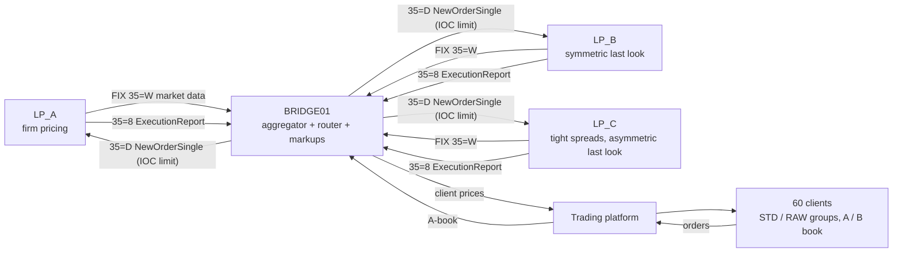

# FIX Bridge & Execution Analytics Lab

A hands-on lab for the work of a **dealing / risk operations desk** at an FX & CFD broker: reading **FIX** logs,
checking **session health**, rebuilding the **aggregated order book**, catching **stale and off-market prices**,
judging **LP execution and last look**, measuring **slippage, latency and markouts**, **reconciling** the platform
against the bridge and LP statements, and building an automated **monitor with an incident playbook**.

No production access is needed. The repo ships a realistic **simulated 2-hour trading session**: 3 liquidity
providers, a bridge/aggregator, a trading platform and 60 clients. Twelve real-world incidents are hidden in it.
Nine lessons, from beginner to advanced, find every one of them *from the data*, the way you would at work.

> **Everything is fictional and generated by [`bridgelab/simulate.py`](bridgelab/simulate.py) with a fixed seed.**
> LP names, clients and prices are synthetic. The FIX messages follow FIX 4.4 (valid BodyLength and CheckSum).

---

## The set-up being simulated



**One session: 15 Oct 2025, 11:30–13:30 UTC.** EURUSD, GBPUSD, XAUUSD · ~65,700 LP quotes · ~69,000 FIX messages ·
1,515 client orders · 1,609 deals · LP trade statements · bridge config and audit log.

---

## Lessons: beginner to advanced

| # | Lesson | Level | What you learn |
|---|---|---|---|
| 00 | [How a liquidity bridge works](lessons/00_market_structure_primer.md) | Primer | LPs, aggregation, markups, A/B book, last look, FIX layers, execution vocabulary |
| 01 | [Reading FIX messages](lessons/01_reading_fix_messages.ipynb) | Beginner | tag=value, header/body/trailer, **BodyLength & CheckSum by hand**, enums, repeating groups, following an order D → 8 → re-route |
| 02 | [FIX session health](lessons/02_fix_session_layer.ipynb) | Beginner → Intermediate | heartbeats, TestRequest, **sequence gaps**, ResendRequest/GapFill, **PossDup**, disconnects, **clock offsets** |
| 03 | [Market data & aggregation](lessons/03_market_data_aggregation.ipynb) | Intermediate | quote tables, update rates, spreads by LP, **rebuilding the aggregated book**, top-of-book share, depth, **news event** |
| 04 | [Feed quality & mispricing](lessons/04_feed_quality_mispricing.ipynb) | Intermediate → Advanced | **quote age / stale feeds**, **bad ticks** vs consensus, **crossed books**, damage from mispriced fills, **designing and replaying price filters** |
| 05 | [Routing & LP execution](lessons/05_routing_lp_execution.ipynb) | Intermediate → Advanced | order lifecycle, fill ratio, reject reasons, **last-look symmetry test**, cost of rejects, partial fills, LP latency, **quantity mapping** |
| 06 | [Execution quality / TCA](lessons/06_execution_quality_tca.ipynb) | Advanced | **slippage symmetry**, **per-hop latency decomposition**, **markup audit**, **markouts & toxic flow**, best-execution report |
| 07 | [Three-way reconciliation](lessons/07_reconciliation.ipynb) | Advanced | platform ↔ bridge ↔ LP statement on ExecID, **duplicates, missing fills, quantity breaks**, position recon, break register |
| 08 | [Monitoring & incident playbook](lessons/08_monitoring_playbook.ipynb) | Advanced (capstone) | 17 alert rules, incident grouping, **detection delay scoring (12/12 caught)**, alert correlation, **playbook** |

📖 **New to this?** Read the [Lesson Guide](lessons/LESSON_GUIDE.md) alongside the notebooks: it explains every section in plain words and how the same task is done on a real dealing desk.

All notebooks are saved **with their outputs and charts**, so they read like reports on GitHub without running anything.

---

## The 12 incidents and what the lessons find

| # | Incident | Found in | What the data shows |
|---|---|---|---|
| S01 | LP_C sends a **bad EURUSD tick** 50 pips off market | 04, 08 | a B-book client bought 20 lots on it within ~90 ms: **≈ $10k loss** to the broker; the A-book attempt was rejected by LP_C and re-routed |
| S02 | LP_B **gold feed freezes for 90 s** while gold rallies | 03, 04, 08 | crossed book for 85 s; **23 B-book fills at the stale price, ≈ $32k**; detected in < 6 s by a per-symbol freeze rule |
| S03 | **News at 12:30** | 03, 06 | price +20 pips in 2 s, spreads 4–5×, top-of-book size −65%, quote rate 4×, **bridge processing 1 → 160 ms** |
| S04 | **Fat-finger markup** (GBPUSD STD 8.0 instead of 0.8 pips) | 06, 08 | found in the audit log; **26 trades / 21 clients overcharged ≈ $3.7k**, a refund list |
| S05 | **Sequence gap** + buggy ResendRequest | 02, 07, 08 | a fill re-sent with PossDupFlag=Y was **booked twice** (2-lot EURUSD position break) |
| S06 | LP_C **session dies** → TestRequest → Logout → reconnect with **ResetSeqNumFlag=Y** | 02, 05, 07, 08 | 3 orders unanswered; **one LP fill never reached the platform** (orphan LP position) |
| S07 | **LP_A latency spike** | 05, 06, 08 | order round trip **7 → ~420 ms** for 10 minutes; the LP side, not the bridge |
| S08 | LP_C **asymmetric last look** | 05, 08 | LP_C rejects ~28% of orders; **91% of its rejects** came when the market had moved in the client's favour; its "tighter" spread costs more after re-routes |
| S09 | **Asymmetric slippage** on the B-book | 06, 08 | B-book: **0% positive** vs 3.6% negative slippage (A-book is two-sided) |
| S10 | **Quantity mapping bug**: gold sent to LP_C in oz = lots × 1 | 05, 07, 08 | 129 orders at 1/100 of the size; **net hedge break ≈ 2 lots (~$850k of gold)** |
| S11 | **Latency-arbitrage clients** | 04, 06, 08 | 3 clients with **+0.6 to +1.3 pip 5-second markouts** (others ≈ 0), the same accounts that hit S01/S02 |
| S12 | LP_C **clock 25 ms ahead** | 02, 08 | "negative" latencies; offset estimated from the Logon round trip |

---

## Quick start

```bash
git clone https://github.com/AliAgha-Analytics/python-fix-bridge-analytics.git
cd python-fix-bridge-analytics
pip install -r requirements.txt
jupyter lab                         # open lessons/01_reading_fix_messages.ipynb and go in order

python scripts/run_monitor.py       # run all 17 monitoring rules -> incident list + reports/*.csv
python generate_data.py             # (optional) regenerate the dataset; same seed = same data
```

Requires Python 3.10+, pandas ≥ 2.2. Each notebook runs in a few seconds.

---

## Data

| Path | Content |
|---|---|
| `data/fix_logs/BRIDGE_LP_*.log` | Raw FIX 4.4 session logs, one line per message: `<log time> <IN\|OUT> <message>` (SOH shown as `\|`). Logon, MD request, market-data snapshots (2 levels), orders, execution reports, heartbeats, test request, resend request, sequence reset, logout |
| `data/platform/orders.csv` | Client orders with **timestamps at every hop** (client send → server → bridge → LP → back), requested & fill price, status, reject reason |
| `data/platform/deals.csv` | Deals booked on the platform, with the LP ExecID for A-book deals |
| `data/platform/client_quotes.csv` | Prices streamed to clients per group (after markup) |
| `data/lp_statements/LP_*_trades.csv` | Each LP's end-of-day trade confirmations |
| `data/reference/` | Symbol specs, **bridge configuration** (routing, filters, markups, quantity multipliers), **bridge audit log**, client groups/books |

## Project structure

```
python-fix-bridge-analytics/
├── lessons/                 # 00 primer (markdown) + 01-08 notebooks with outputs
├── bridgelab/
│   ├── fix.py               # build / parse / validate / explain FIX messages, read session logs
│   ├── simulate.py          # the market, LPs, bridge, platform, clients and the 12 incidents
│   ├── analysis.py          # loaders, quote tables, aggregated book, consensus mid, as-of lookups
│   ├── monitor.py           # 17 alert rules + incident grouping
│   └── plotting.py          # shared chart style (one fixed colour per LP)
├── scripts/run_monitor.py   # command-line incident report
├── data/                    # generated dataset (see above)
├── generate_data.py
└── requirements.txt
```

## FIX quick reference

| 35= | Message | | Tag | Meaning |
|---|---|---|---|---|
| A / 5 | Logon / Logout | | 34 / 52 | MsgSeqNum / SendingTime |
| 0 / 1 | Heartbeat / TestRequest | | 11 / 37 / 17 | ClOrdID / OrderID / **ExecID** |
| 2 / 4 | ResendRequest / SequenceReset | | 54 / 38 / 44 | Side / OrderQty / Price |
| V / W | MD request / MD snapshot | | 150 / 39 | ExecType / OrdStatus |
| D / 8 | NewOrderSingle / ExecutionReport | | 31 / 32 / 14 / 151 | LastPx / LastQty / CumQty / LeavesQty |
| | | | 43 / 122 / 141 | PossDupFlag / OrigSendingTime / ResetSeqNumFlag |

---

**Tools:** Python · pandas · NumPy · Matplotlib · Jupyter · FIX 4.4

