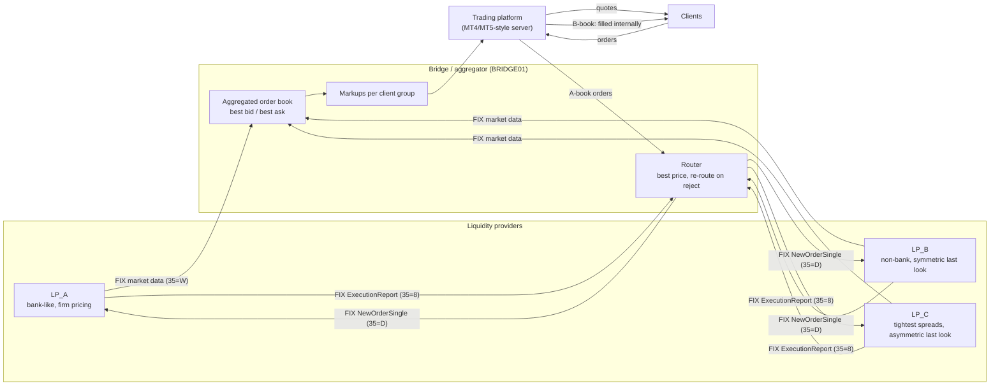
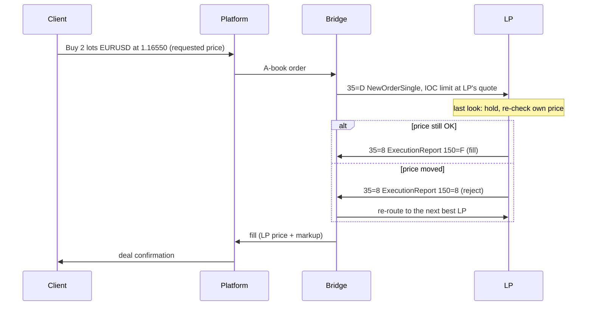

# Lesson 00: How a broker's liquidity bridge works (primer)

**Level:** beginner · **No code**. Read this first; every later lesson builds on these ideas.

> Every lesson repeats the meaning of each FIX tag and term where it's used, so you never need to memorise anything.
> There's also a plain-words companion, the [Lesson Guide](LESSON_GUIDE.md), and a cheat sheet with 10 worked FIX
> examples at the end of [Lesson 01](01_reading_fix_messages.ipynb).

---

## 1. The players



| Component | What it does | What can go wrong |
|---|---|---|
| **Liquidity provider (LP)** | Banks or non-bank market makers. They stream two-way prices and fill orders sent to them | Stale or bad prices, rejects, slow responses, session drops |
| **Bridge / aggregator** (PrimeXM, Centroid, oneZero…) | Connects to LPs over FIX, merges their prices into one book, applies markups, routes orders | Misconfiguration (markups, symbol mapping, quantities), missing filters, routing bugs, queueing |
| **Trading platform** (MT4/MT5, cTrader…) | Shows prices to clients, takes their orders, books deals, manages accounts | Wrong execution settings (slippage), stale prices, booking errors |
| **A-book / B-book** | A-book: the order is passed to an LP, so the broker is hedged. B-book: the broker takes the other side itself | B-book carries market risk and is exposed to toxic flow and mispricing |

---

## 2. Prices: from LP quotes to the client's screen

1. Each LP sends **snapshots** of its book: bid and ask prices with available sizes, at several levels.
2. The bridge keeps the **latest quote from each LP** and builds the **aggregated top of book**: the highest bid and the lowest ask across all LPs.
3. The bridge adds a **markup** per client group. For example, the Standard group gets +0.8 pips per side and the Raw group gets 0 (Raw clients pay a commission instead).
4. The platform streams this price to clients.

**Key idea:** the aggregated book is only as good as its **worst** input. One stale or wrong LP quote can become the "best price" and be shown to every client. That's why bridges need **price filters**: staleness checks, spike filters and crossed-book protection.

---

## 3. Orders: from the client's click to an LP fill



- **Latency** is the sum of every hop: client → platform → bridge → LP → (last look) → bridge → platform → client. Lesson 06 decomposes it.
- **Slippage** = fill price − requested price, signed so that negative means worse for the client.
- **Last look:** the LP holds the order for a few milliseconds and can reject it if the price moved. It's **symmetric** when the LP rejects moves in either direction, and **asymmetric** when it rejects only the moves that hurt the LP. Asymmetric last look is heavily criticised by the FX Global Code.
- **Partial fill:** the order is larger than the LP's available size. The remainder is cancelled (IOC) and routed elsewhere.

---

## 4. FIX in one page

FIX (Financial Information eXchange) is the standard protocol between bridges and LPs. Messages are `tag=value` pairs separated by the SOH character (shown as `|` in logs):

```
8=FIX.4.4|9=148|35=D|49=BRIDGE01|56=LP_B|34=7|52=20251015-11:30:45.773|11=BR700009-1|55=XAUUSD|54=2|38=538|40=2|44=4086.27|59=3|10=228|
```

**The same message in plain English:** `35=D` (MsgType = NewOrderSingle, "a new order") from `49=BRIDGE01` (our
bridge) to `56=LP_B`; it's message number `34=7` of the day on this connection, sent at `52=…11:30:45.773`. The order:
`11=BR700009-1` (our reference: client order 700009, 1st attempt), `55=XAUUSD` (gold), `54=2` (Side = Sell),
`38=538` (quantity: 538 ounces), `40=2` (OrdType = Limit: only at this price or better), `44=4086.27` (the limit price),
`59=3` (TimeInForce = IOC, Immediate Or Cancel: fill now or cancel). `9=148` and `10=228` are control numbers (length and
checksum) that prove the message wasn't damaged. Lesson 01 explains all of this step by step.

| Part | Tags | Meaning |
|---|---|---|
| Header | 8 BeginString, 9 BodyLength, 35 MsgType, 49 Sender, 56 Target, 34 MsgSeqNum, 52 SendingTime | Who, what, when, and the sequence number |
| Body | depends on the message type | e.g. 55 Symbol, 54 Side, 38 OrderQty, 44 Price |
| Trailer | 10 CheckSum | Integrity check |

**Two layers:**
- **Session layer:** keeps the connection healthy. Logon (A, "hello"), Heartbeat (0, "I'm still here"), TestRequest (1, "are you there?"), ResendRequest (2, "send me the messages I missed"), SequenceReset (4, "skip these message numbers"), Logout (5, "goodbye"), and the message numbers (tag 34) that let each side spot a lost message.
- **Application layer:** the business. MarketDataRequest (V, "send me prices"), MarketDataSnapshot (W, "here are my prices"), NewOrderSingle (D, "here's an order"), ExecutionReport (8, "here's what happened to your order").

Lessons 01 and 02 teach you to read both by hand.

---

## 5. Execution-quality vocabulary

| Term | Definition |
|---|---|
| Spread | ask − bid, in pips (EURUSD pip = 0.0001; XAUUSD pip here = 0.10 USD) |
| Quote age / staleness | time since an LP last updated a symbol |
| Crossed / locked book | best bid > best ask (crossed) or = best ask (locked). Usually means one input is stale or wrong |
| Fill ratio / reject rate | fills ÷ orders sent to an LP |
| Hold time | time an LP keeps an order before answering (last look window) |
| Slippage | difference between requested and executed price |
| Markout | how the market moves **after** a fill (at +100 ms, 1 s, 5 s, 30 s). Consistently positive markouts for a client = toxic / informed flow |
| Effective spread | 2 × \|fill − mid\|: what the client really paid |
| Fill-to-quote latency | time between the quote the client saw and the fill |

---

## 6. What happens in this dataset

The data covers **one 2-hour session on 15 Oct 2025 (11:30–13:30 UTC)**, with 3 LPs, 3 symbols, 60 clients, ~65,000 LP quotes and ~1,500 client orders. Twelve incidents are hidden in it. Every lesson finds some of them *from the data*, the way you would at work:

| # | Incident | Found in |
|---|---|---|
| S01 | Bad tick from LP_C (EURUSD 50 pips off market) | 04, 08 |
| S02 | Stale LP_B gold feed during a rally → crossed book, latency arbitrage | 03, 04, 08 |
| S03 | News event: spreads widen, depth drops, bridge queue builds up | 03, 06 |
| S04 | Fat-finger markup on GBPUSD Standard group | 06, 08 |
| S05 | Sequence gap → buggy resend → duplicate fill booked | 02, 07, 08 |
| S06 | LP_C session dies → heartbeat timeout → missing fill | 02, 05, 07, 08 |
| S07 | LP_A latency spike | 05, 06, 08 |
| S08 | Asymmetric last look at LP_C | 05, 08 |
| S09 | Asymmetric slippage on B-book | 06, 08 |
| S10 | Quantity mapping bug (gold in ounces) for LP_C | 05, 07, 08 |
| S11 | Latency-arbitrage clients (toxic flow) | 04, 06, 08 |
| S12 | LP_C clock 25 ms ahead | 02, 08 |

Lesson 08 puts everything together as an automated **monitoring and alerting engine** with an incident playbook.
